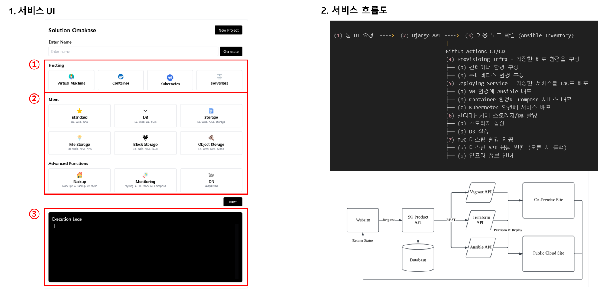
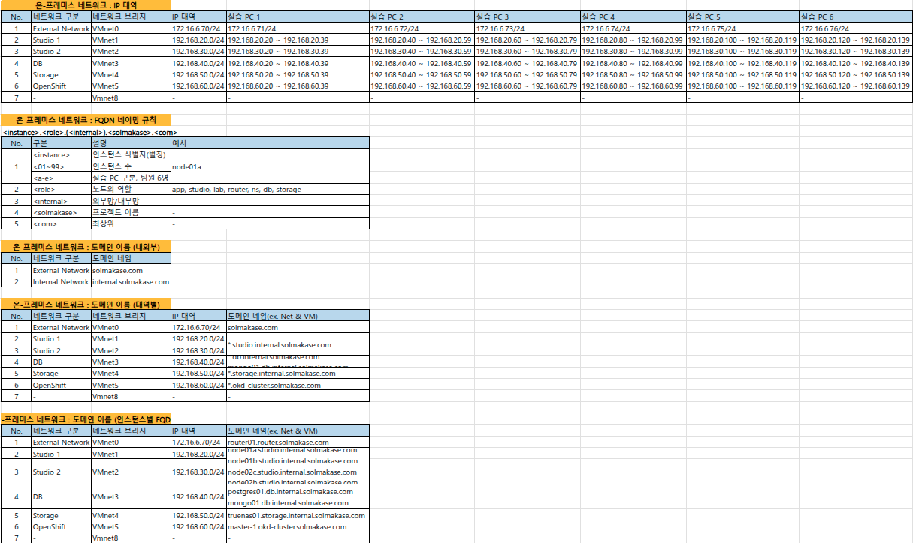
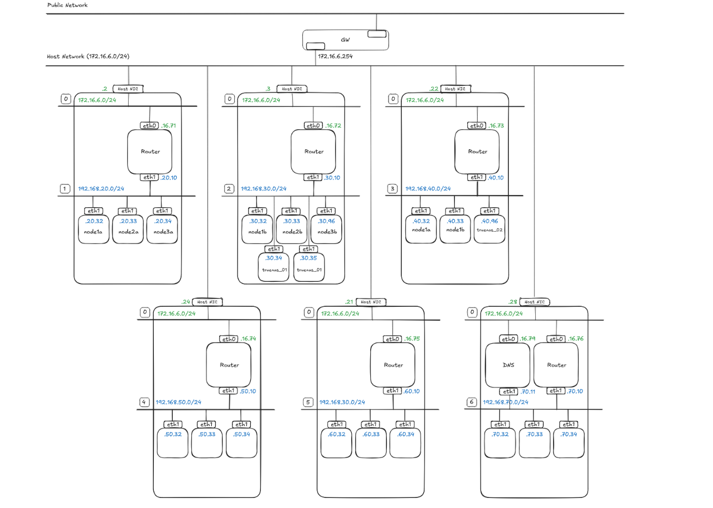
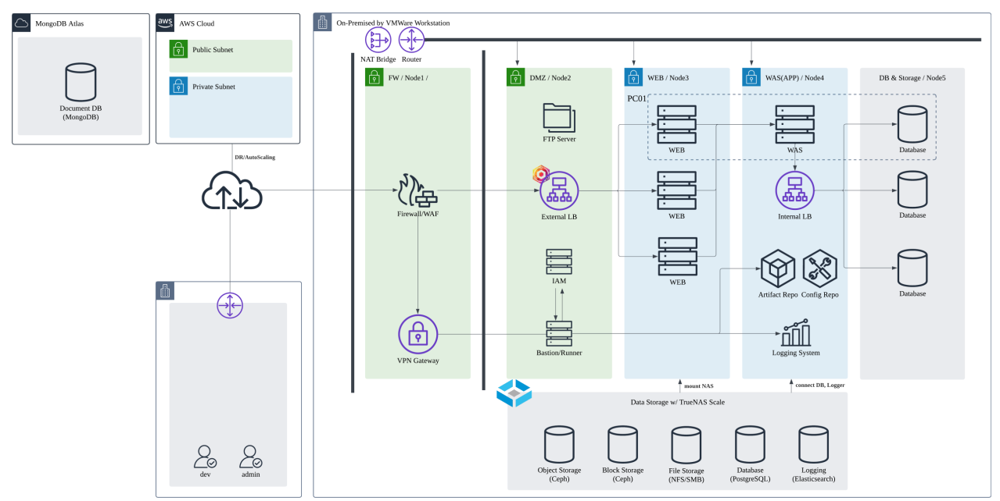

# Solmakase - AI 기반 인프라 오마카세 서비스

## 프로젝트 소개

**Solmakase**는 사용자의 요구사항을 분석하여 최적의 인프라 아키텍처를 자동 설계하고, 
IaC(Infrastructure as Code) 코드를 생성하여 실제 배포까지 지원하는 AI 기반 인프라 오마카세 서비스입니다. 
비IT 직군 기획자부터 바이브 코딩 개발자까지, 기술적 지식 없이도 프로덕션 레벨의 인프라를 구축할 수 있도록 지원합니다.

## 주요 기능

### 서비스 UI 및 흐름도

### 1. 요구사항 수집 및 분석
- **다중 입력 채널**: 설문조사, 문서 업로드(PDF/docx/pptx), 대화형 채팅, 전문가 모드
- **AI 기반 분석**: RAG를 활용한 문서 분석 및 Agent LLM을 통한 요구사항 구조화
- **기술 스택 추천**: 외부 툴 연동을 통한 최적의 기술 스택 자동 추천

### 2. 인프라 설계 및 코드 생성
- **자동 설계**: 온프레미스/클라우드 각각에 대한 최적의 인프라 아키텍처 제안
- **IaC 코드 생성**: Terraform, Ansible, Kubernetes Manifest 등 다양한 IaC 도구 지원
- **실시간 수정**: 프롬프트 기반 코드 수정 및 변경사항 미리보기

### 3. 배포 및 모니터링
- **자동 배포**: 생성된 IaC 코드 기반 실제 인프라 환경 배포
- **시각화 대시보드**: React Flow를 활용한 인프라 구조 시각화 및 네트워크 커넥션 표시
- **실시간 모니터링**: 리소스 상태, 메트릭, 비용 추적 및 네트워크 연결 테스트

## 기술 스택

**Frontend**
- React 18+ / TypeScript 5+ / React Flow 11+ / Tailwind CSS 3+

**Backend**
- FastAPI 0.104+ / Python 3.10+ / SQLAlchemy / Alembic

**AI/LLM**
- LangChain / LangGraph / OpenAI/Claude / ChromaDB/FAISS

**Infrastructure**
- Terraform 1.6+ / Ansible 8+ / Docker / Kubernetes

**Monitoring**
- Prometheus / Grafana

## 아키텍처

- Clean Architecture 기반으로 설계되어 도메인 중심의 계층형 구조를 채택했습니다. 
- Domain Layer, Use Case Layer, Interface Adapter Layer, Framework Layer로 구분하여  
  의존성 역전 원칙을 적용했습니다.

### 네트워크 구성

### 인프라 구성도

## 개발 기간

총 7일 (개인 프로젝트)

